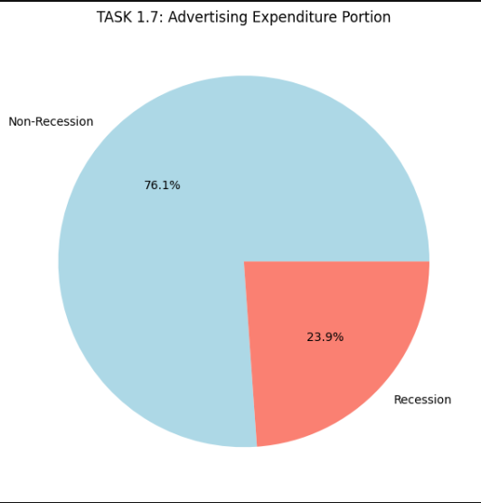
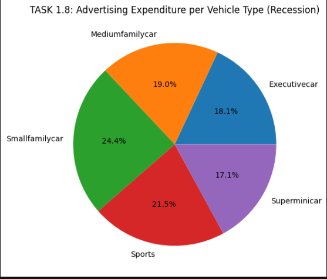
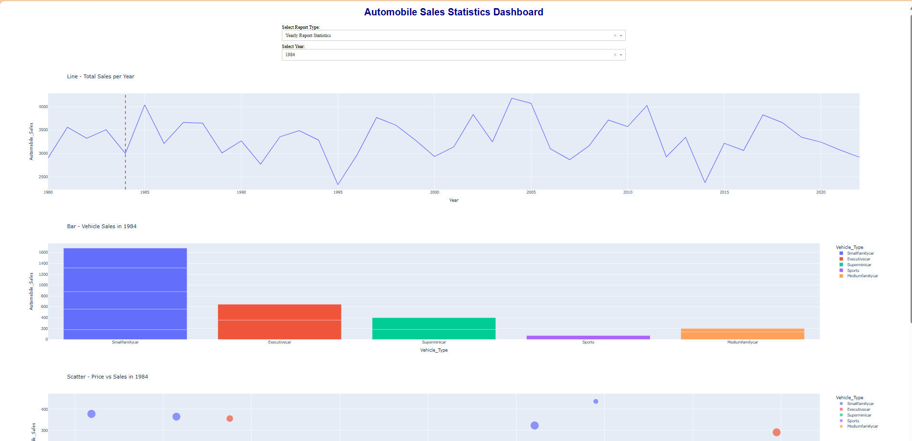
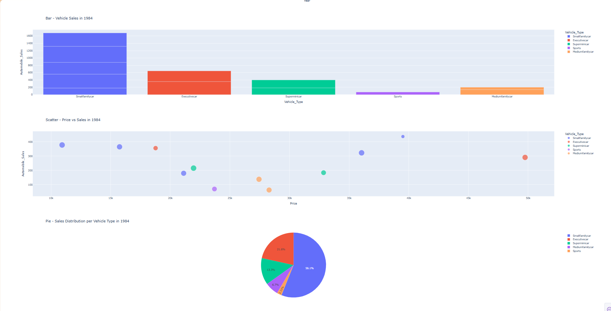

# 🚗 Automobile Sales Analysis & Interactive Dashboard

An end-to-end **Data Science and Business Analytics project** that analyzes automobile sales trends, recession impact, vehicle-type performance, advertising expenditure, pricing, seasonality, and unemployment.

The project combines **Python-based Exploratory Data Analysis (EDA)** with an **interactive Plotly Dash dashboard** to turn automobile sales data into meaningful business insights.

---

## 📌 Project Overview

The automobile industry is influenced by economic conditions, pricing, advertising, seasonality, and consumer demand.

This project analyzes automobile sales data from **2000 to 2019** to investigate:

- Automobile sales trends over time
- The impact of recession periods on automobile sales
- Sales performance across vehicle types
- Advertising expenditure across vehicle categories
- Seasonal patterns in automobile sales
- The relationship between automobile prices and sales
- The relationship between unemployment and automobile sales

An interactive **Dash dashboard** was also developed to make the analysis easier to explore and interpret.

---

## 🎯 Business Objectives

The main objectives of this project are to:

1. Analyze automobile sales trends over time.
2. Compare automobile sales during recession and non-recession periods.
3. Identify vehicle categories with stronger sales performance.
4. Analyze advertising expenditure across vehicle types.
5. Investigate seasonal patterns in automobile sales.
6. Explore the relationship between automobile price and sales.
7. Examine the relationship between unemployment and automobile sales.
8. Build an interactive dashboard for automobile sales analysis.

---

# 📊 Dataset

The dataset is generated programmatically using **NumPy and Pandas** with a fixed random seed for reproducibility.

### Dataset Characteristics

- **Time period:** 2000–2019
- **Number of observations:** 1,200
- **Number of features:** 9
- **Vehicle categories:** 5

### Vehicle Types

- Superminicar
- Smallfamilycar
- Mediumfamilycar
- Executivecar
- Sports

### Dataset Features

| Feature | Description |
|---|---|
| `Year` | Year of observation |
| `Month` | Month of observation |
| `Vehicle_Type` | Automobile category |
| `Automobile_Sales` | Automobile sales |
| `Advertising_Expenditure` | Advertising expenditure |
| `GDP` | Gross Domestic Product |
| `Unemployment_Rate` | Unemployment rate |
| `Recession` | Indicates whether the observation belongs to a recession period |
| `Average_Price` | Average automobile price |

### Recession Years

The dataset includes the following recession years:

- 2001
- 2008
- 2009
- 2012
- 2015

---

# 🔎 Exploratory Data Analysis

## 1. Automobile Sales Over Years

The analysis examines automobile sales across the full observation period to identify changes in sales over time.

This visualization provides an overall view of automobile sales trends and fluctuations.


---

## 2. Recession vs Non-Recession Analysis

A key objective of the project is to investigate how automobile sales differ between recession and non-recession periods.

The analysis compares average annual automobile sales across the two economic conditions.

### Key Finding

| Period | Average Annual Sales |
|---|---:|
| Recession | 20,591.6 |
| Non-Recession | 25,167.5 |

Average annual automobile sales during recession periods were approximately **18.2% lower** than during non-recession periods.

This indicates that economic downturns are associated with lower automobile sales in the analyzed dataset.


> **Note:** This is an observational analysis. The result does not establish a causal relationship between recession conditions and automobile sales.

---

## 3. Sales by Vehicle Type

The project analyzes automobile sales across different vehicle categories to identify stronger and weaker performing segments.

During recession periods, cumulative sales by vehicle type were:

| Vehicle Type | Recession Sales |
|---|---:|
| Mediumfamilycar | 27,588 |
| Smallfamilycar | 27,234 |
| Superminicar | 22,756 |
| Executivecar | 15,125 |
| Sports | 10,255 |

### Business Insight

Medium-family and small-family vehicles show the strongest sales performance during recession periods, while sports vehicles have substantially lower sales.

This type of segmentation can help businesses understand which vehicle categories may demonstrate greater demand during challenging economic conditions.





---

## 4. Seasonality Analysis

Automobile sales can vary across different months of the year.

The project incorporates monthly patterns and analyzes how automobile sales change throughout the year.

Seasonal effects are included in the generated dataset to support the exploration of monthly sales behavior.

---

## 5. Advertising Expenditure

Advertising expenditure is analyzed as one of the key business variables in the project.

The analysis allows automobile sales and marketing expenditure to be examined across different periods and vehicle categories.

The project also includes advertising expenditure as part of the interactive dashboard analysis.

---

## 6. Unemployment and Automobile Sales

The project investigates the relationship between unemployment rates and automobile sales.

The purpose is to explore whether changes in unemployment coincide with changes in automobile demand.


> **Note:** This analysis is exploratory and should not be interpreted as evidence of a causal relationship.

---

# 📈 Interactive Dashboard

A major component of this project is an interactive dashboard developed using **Plotly Dash**.

The dashboard is titled:

> **Automobile Sales Statistics Dashboard**

The dashboard allows users to select different reports and years and explore automobile sales statistics interactively.



---

# 📊 Dashboard Reports

## Recession Report

The **Recession Report** focuses on automobile sales during recession periods.

The dashboard provides visualizations covering:

- Yearly automobile sales during recession periods
- Automobile sales by vehicle type
- Advertising expenditure by vehicle type
- Price and sales analysis

This report provides a business-focused view of automobile market performance during economic downturns.



---

## Yearly Sales Statistics Report

The **Yearly Sales Statistics Report** allows users to select a year and explore automobile sales statistics.

The report includes:

- Monthly automobile sales by vehicle type
- Automobile sales by vehicle type
- Advertising expenditure by vehicle type
- Price and sales analysis

The interactive controls make it possible to explore different years and vehicle categories without manually recreating the analysis.

---

# 🧠 Key Business Insights

### 1. Sales are lower during recession periods

The analysis shows lower average annual automobile sales during recession periods compared with non-recession periods.

The difference is approximately **18.2%** in the generated dataset.

### 2. Vehicle categories perform differently

Mediumfamilycar and Smallfamilycar demonstrate stronger sales performance during recession periods compared with Executivecar and Sports vehicles.

### 3. Economic variables provide additional context

GDP and unemployment rate are included in the analysis to investigate how broader economic conditions relate to automobile sales.

### 4. Automobile sales show monthly patterns

The analysis incorporates seasonality to investigate how sales vary across different months.

### 5. Advertising expenditure can be evaluated alongside sales

Advertising expenditure is analyzed across different vehicle categories and periods, providing additional business context around marketing activity.

---

# 🛠️ Technical Approach

The project follows a structured data analytics workflow:

```text
Data Generation
       ↓
Data Preparation
       ↓
Exploratory Data Analysis
       ↓
Statistical Analysis
       ↓
Data Visualization
       ↓
Business Insights
       ↓
Interactive Dashboard
